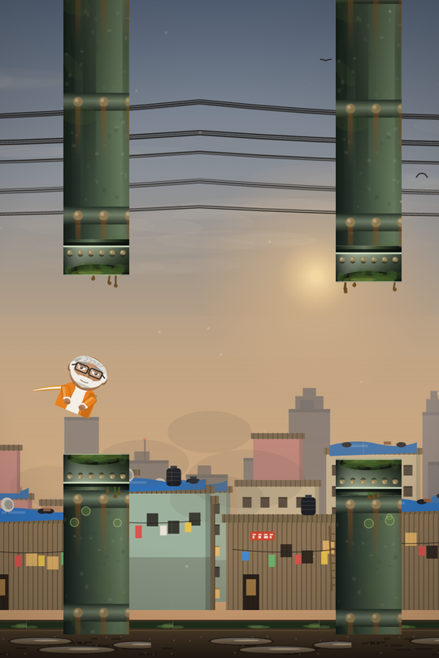

# Modi Flappy

A Flappy Bird knock-off where you play a caricature of Narendra Modi, flapping
through the overflowing sewer pipes of a Mumbai slum at dusk.



## What it is

It's a meme game, and it is exactly as serious as that sounds. Tap to flap, thread
the gap between two dripping storm drains, don't hit anything. Every pipe you clear
is a point, the gap narrows and the pace picks up as you go, and hitting something
gets you a Hindi expletive shouted at you.

The whole thing is one HTML file, one CSS file and one JavaScript file. No build
step, no framework, no dependencies, no bundler — open a static server and it runs.
Every visual in it, including the character and the entire slum skyline, is drawn
with Canvas 2D path calls in `game.js`; there are no image assets at all.

## Running it

You need Python 3 (or any static file server) and a modern browser.

```bash
python3 serve.py
```

Then open <http://127.0.0.1:8081>. Set `PORT` to use a different port.

`serve.py` is `python3 -m http.server` plus a `POST /__shutdown` endpoint, which is
what lets the in-game **Quit** button stop the server as well as the page. Plain
`python3 -m http.server 8081` works just as well if you'd rather — Quit will then
shut the page down and tell you the server is still running.

Don't open `index.html` straight off the filesystem — `file://` blocks the `fetch()`
calls the audio loader uses, so the music and sound effects will silently not work.

## Controls

| Action | Default |
|---|---|
| Flap | `Space`, `↑`, or click / tap the canvas |
| Restart after a crash | `R` |
| Start from the menu | `Enter`, or any flap key |
| Cancel a key rebind | `Esc` |

Flapping during the "GET READY" countdown starts the run immediately rather than
being swallowed.

There's no pause key — the game auto-pauses when the tab loses focus and resumes
when it comes back, so you won't return to a dead bird.

### Quit

The **Quit** button on the menu is a real teardown, not a pause. It cancels the
animation loop, closes the `AudioContext` so the OS audio device is released,
drops the sprites and clears the canvas — and asks the server to shut down too.
Nothing restarts afterwards; you reload the page (and restart the server) to play
again. It takes two clicks, since it sits next to Start and can't be undone.

## Settings

- **Volume** — separate music and SFX sliders.
- **Graphics** — `Auto`, `Low`, `Medium`, `High`. This only ever changes decoration
  (parallax layers, particles, ambient effects). Gap sizes, pipe spacing and speed
  are identical on every setting, so the difficulty never changes with it.
- **Controls** — all three key bindings are remappable.

Settings and your high score persist in `localStorage`.

## How it works

A few things in here are less obvious than they look:

**The simulation is fixed-timestep.** It runs at exactly 60 steps per second no
matter what the display does, via an accumulator in `loop()`. Every physics constant
(`GRAVITY`, `FLAP`, and the speed `speedFor()` returns) is per-step. This matters more than it
sounds: with frame-based physics, a 120Hz display gets 4× the gravity but only 2× the
flap strength, so the bird plummets and the game is unplayable — which is precisely
the bug this replaced.

**Pipe spacing is a distance, not a duration.** `spacingFor()` returns pixels, measured
from `SPAWN_X`, so the gap between pipes doesn't depend on frame rate either. Gap
centres follow a bounded random walk (`MAX_CENTER_DELTA`) so two consecutive pipes
can never demand more vertical travel than the horizontal spacing gives you time for.

**The hitbox is the art.** `gapTop` and `gapBottom` are the same numbers used both to
draw the pipe mouths and to test collisions, and each pipe's flange collar is drawn
*inside* the barrel rather than overhanging it. There's no region where you look
clear but die, or look blocked but survive.

**All static art is pre-rendered.** Parallax layers, the pipe barrel and mouths, and
the character are rasterised once into offscreen canvases by `buildSprites()` and
then blitted. A frame is about 22 `drawImage` calls and zero gradient allocations.

**Music loops from an offset.** The theme's source file opens with a groan and a
quiet lead-in, so it's decoded into an `AudioBuffer` and looped from
`MUSIC_LOOP_START` rather than trimmed — re-encoding the mp3 would add encoder delay
that hiccups on every loop, and a stream copy can only cut on a frame boundary.

**Quality auto-detect watches delivered frame rate**, not render time. Timing
`render()` only measures the cost of *issuing* canvas commands; the GPU work is
asynchronous and uncounted, so it reads as fast on every machine and can never
detect one that's struggling.

## Project layout

```
index.html          markup, HUD, and the menu / game-over / settings panels
style.css           page chrome, panels, HUD
game.js             everything else, in labelled sections:
                    CONFIG · SPRITES · AUDIO · SIMULATION · RENDER · QUIT · UI
serve.py            static server with a shutdown endpoint (optional)
assets/audio/       theme.mp3 (music), flap.mp3 (crash sound)
docs/screenshot.png the image above
```

The game itself is entirely client-side — `serve.py` hands over static files and
is not otherwise involved. There is no backend, no state on a server, and nothing
to deploy beyond the files in this directory.

## Tweaking it

Most of what you'd want to change is a named constant at the top of `game.js`:

| Constant | Does |
|---|---|
| `GAP_START` / `GAP_END` / `GAP_AT` | How wide the gap is, and how fast it narrows |
| `SPEED_START` / `SPEED_END` | Scroll speed ramp |
| `SPACING_START` / `SPACING_END` | Distance between pipes |
| `MODI_SCALE` | How big the character is drawn |
| `BIRD_R` | Collision radius — the real difficulty lever |
| `MUSIC_LOOP_START` | Where the theme loops from |

Sprites are plain Canvas draw functions in the `SPRITES` section, each returning an
offscreen canvas from `makeSprite(w, h, drawFn)`. To swap the character for a bitmap,
replace `buildModi()` with something that draws an `Image` into the same
`MODI_W × MODI_H` box; nothing downstream needs to change.

## License

Copyright (C) 2026 happyc0der.

Modi Flappy is free software, released under the **GNU General Public License,
version 3 or (at your option) any later version**. The full text is in
[LICENSE](LICENSE).

That means you're free to run it, study it, change it and pass it on — and if you
distribute a modified version, you have to pass those same freedoms along with it,
source included. Copyleft: the freedom travels with the code.

```
SPDX-License-Identifier: GPL-3.0-or-later
```

This program is distributed in the hope that it will be useful, but WITHOUT ANY
WARRANTY; without even the implied warranty of MERCHANTABILITY or FITNESS FOR A
PARTICULAR PURPOSE. See the GNU General Public License for more details.

## Notes

- **The crash sound is explicit.** `assets/audio/flap.mp3` is a clip of Hindi
  profanity. It plays every time you die. Turn the SFX slider down if that's a
  problem where you are.
